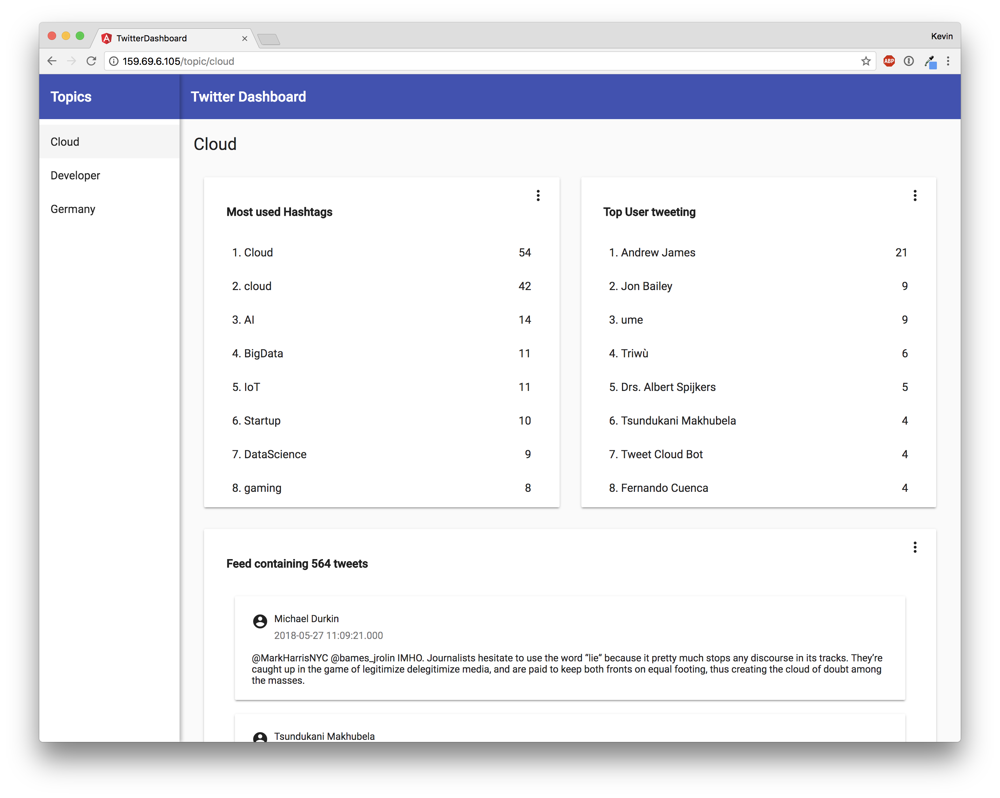

# Kafka Twitter Project

This project implements a dashboard analyzing twitter topics. Currently implemented are the topics Cloud, Developer and Germany. All incoming tweets are analyzed to get the most used Hashtags and the users with the most recent tweets about this topic.

Therefore, the project uses:

* Confluent with Apache Kafka and KSQL
* Node Express.js-Backend
* Angular 6 Frontend



## Configuration

1. Install [Confluent](http://confluent.io)
2. Start confluent with `confluent start`
3. Compile Kafka-Connect-Module with 

```
$ cd kafka-connect-twitter 
$ mvn clean package
$ cd target
$ tar -xvf kafka-connect-twitter-0.2-SNAPSHOT.tar.gz
```
To get Kafka Connect use the connector, the schema-registry configuration file needs to be modified

`etc/schema-registry/connect-avro-distributed.properties` needs the following line added: 

```
plugin.path=share/java,/PATH_TO_REPO/kafka-connect-twitter/
```

Restart confluent Connect:

```
$ confluent stop connect
$ confluent start connect
```

After the Twitter API keys are added to `twitter_germany.json`, it can be loaded.

```
$ confluent load twitter_germany -d twitter-germany.json
```

Make sure tweets are displayed running:

```
$ kafka-console-consumer --bootstrap-server localhost:9092 --from-beginning --topic twitter_germany|jq '.Text'
```

Start KSQL with the command `ksql`

There you can simply run the repo's startup.sql script.

```
> RUN SCRIPT 'REPO/startup.sql';
```

If the script executed successfully, the displayed message field is empty.

## Client

Install Angular CLI with 

```
$ npm install -g @angular/cli
```

To build the app, cd to client app and use Angular's build command:

```
$ cd twitter-dashboard
$ npm install
$ ng build
```

## Server

First, install typescript compiler:

```
$ npm install -g typescript
```

Transpile the project with the command:

```
$ cd server
$ npm install
$ tsc -p .
``` 

Use node to run it:

```
$ node app.js
```

Visit `localhost:8080`

## Troubleshooting

#### LEADER\_NOT\_AVAILABLE

Modify `etc/kafka/server.properties`:

Add the line:

```
listeners = PLAINTEXT://localhost:9092
```

#### OUT OF MEMEORY

For Production environments, 32 GB RAM are recommended. Minimum requirements are 4 GB.
After some days running, Kafka runs out of memory when using 4 GB. This is due to tweets being saved for 7 days. You can reduce this by reducing *log.retention.hours* setting in `etc/kafka/server.properties`. 

#### Reload topic

To reload a topic you, need to load and unload it:

```
$ confluent unload twitter_germany
$ confluent load twitter_germany -d twitter-germany.json
```

## KSQL

Certain KSQL streams and tables could be created by:

```
CREATE STREAM germany_raw (CreatedAt bigint,Id bigint, Text VARCHAR, SOURCE VARCHAR, Truncated VARCHAR, InReplyToStatusId VARCHAR, InReplyToUserId VARCHAR, InReplyToScreenName VARCHAR, GeoLocation VARCHAR, Place VARCHAR, Favorited VARCHAR, Retweeted VARCHAR, FavoriteCount VARCHAR, User VARCHAR, Retweet VARCHAR, Contributors VARCHAR, RetweetCount VARCHAR, RetweetedByMe VARCHAR, CurrentUserRetweetId VARCHAR, PossiblySensitive VARCHAR, Lang VARCHAR, WithheldInCountries VARCHAR, HashtagEntities VARCHAR, UserMentionEntities VARCHAR, MediaEntities VARCHAR, SymbolEntities VARCHAR, URLEntities VARCHAR) WITH (KAFKA_TOPIC='twitter_germany',VALUE_FORMAT='JSON');
```
```
CREATE STREAM germany AS SELECT TIMESTAMPTOSTRING(CreatedAt, 'yyyy-MM-dd HH:mm:ss.SSS') AS CreatedAt, EXTRACTJSONFIELD(user,'$.Name') AS user_Name, Text,hashtagentities FROM germany_raw ;
```

```
CREATE TABLE user_germany_count AS SELECT user_screenname, count(*) AS  tweet_count FROM germany WINDOW TUMBLING (SIZE 1 HOUR) GROUP BY user_screenname ;
```

```
CREATE TABLE USER_GERMANY_COUNT_DISPLAY AS SELECT TIMESTAMPTOSTRING(ROWTIME, 'yyyy-MM-dd HH:mm:ss.SSS') AS WINDOW_START, USER_SCREENNAME, TWEET_COUNT FROM user_germany_count;
```

